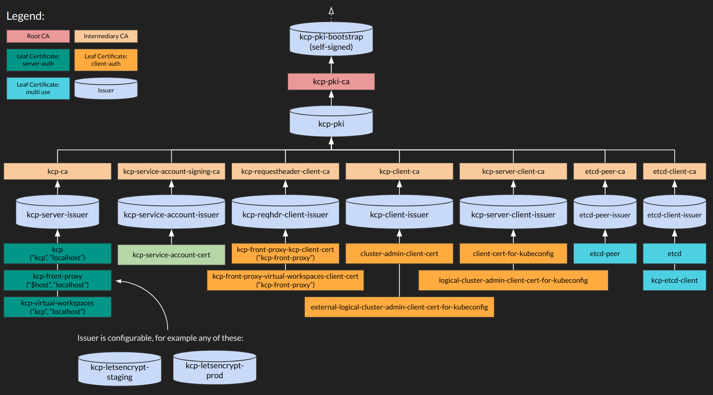

# KCP Helm Charts

Repository for KCP helm charts.

## Pre-requisites

- Cert-manager installed and running
- Ingress installed (e.g. nginx-ingress or OpenShift router)

## Usage

[Helm](https://helm.sh) must be installed to use the charts.  Please refer to
Helm's [documentation](https://helm.sh/docs) to get started.

Once Helm has been set up correctly, add the repo as follows:

    helm repo add kcp https://kcp-dev.github.io/helm-charts

If you had already added this repo earlier, run `helm repo update` to retrieve
the latest versions of the packages.  You can then run `helm search repo
kcp` to see the charts.

To install the kcp chart:

    helm install my-kcp kcp/kcp

To uninstall the chart:

    helm delete my-kcp

## Development usage

To install using the local chart:

    helm install kcp ./charts/kcp --values ./myvalues.yaml --namespace kcp --create-namespace

Changes can then be made locally and tested via upgrade:

    helm upgrade kcp ./charts/kcp --values ./myvalues.yaml --namespace kcp

Note `myvalues.yaml` will depend on your environment (you must specify which ingress method
is used to expose the front-proxy endpoint), a minimal example:

```yaml
externalHostname: "<external hostname as exposed by ingress method below>"
kcpFrontProxy:
  ingress:
    enabled: true
    annotations:
      kubernetes.io/ingress.class: "nginx"
      nginx.ingress.kubernetes.io/backend-protocol: "HTTPS"
  certificates:
    issuerSpec:
      acme:
        server: https://acme-v02.api.letsencrypt.org/directory
        privateKeySecretRef:
          name: kcp-front-proxy-issuer-account-key
        solvers:
        - http01:
            ingress:
              serviceType: ClusterIP
```

## Accessing the deployed KCP

To access the deployed KCP, it will be necessary to create a kubeconfig which connects via the
front-proxy external endpoint (specified via `externalHostname` above).

The content of the kubeconfig will depend on the KCP authentication configuration, below we describe
one option which uses client-cert auth to enable a kcp-admin user.

:warning: this example allows global admin permissions across all workspaces, you may also want to
consider using more restricted groups for example `system:kcp:workspace:access` to provide a
user `system:authenticated` access to a workspace.

### PKI

The chart will create a full PKI system, with root CA, intermediate CAs and more.



### Create kubeconfig and add CA cert

First we get the CA cert for the front proxy, saving it to a file `ca.crt`

    kubectl get secret kcp-front-proxy-cert -o=jsonpath='{.data.tls\.crt}' | base64 -d > ca.crt

Now we create a new kubeconfig which references the `ca.crt`

    kubectl --kubeconfig=admin.kubeconfig config set-cluster base --server https://<externalHostname>:443 --certificate-authority=ca.crt
    kubectl --kubeconfig=admin.kubeconfig config set-cluster root --server https://<externalHostname>:443/clusters/root --certificate-authority=ca.crt

### Create client-cert credentials

Now we must add credentials to the kubeconfig, so requests to the front-proxy may be authenticated.

One way to do this is to create a client certificate with a cert-manager `Certificate`:

    $ cat admin-client-cert.yaml
    apiVersion: cert-manager.io/v1
    kind: Certificate
    metadata:
      name: cluster-admin-client-cert
    spec:
      commonName: cluster-admin
      issuerRef:
        name: kcp-client-issuer
      privateKey:
        algorithm: RSA
        size: 2048
      secretName: cluster-admin-client-cert
      subject:
        organizations:
        - system:kcp:admin
      usages:
      - client auth

    $ kubectl apply -f admin-client-cert.yaml

This will result in a `cluster-admin-client-cert` secret which we can again save to local files:

    $ kubectl get secret cluster-admin-client-cert -o=jsonpath='{.data.tls\.crt}' | base64 -d > client.crt
    $ kubectl get secret cluster-admin-client-cert -o=jsonpath='{.data.tls\.key}' | base64 -d > client.key
    $ chmod 600 client.crt client.key

We can now add these credentials to the `admin.kubeconfig` and access KCP:

    $ kubectl --kubeconfig=admin.kubeconfig config set-credentials kcp-admin --client-certificate=client.crt --client-key=client.key
    $ kubectl --kubeconfig=admin.kubeconfig config set-context base --cluster=base --user=kcp-admin
    $ kubectl --kubeconfig=admin.kubeconfig config set-context root --cluster=root --user=kcp-admin
    $ kubectl --kubeconfig=admin.kubeconfig config use-context root
    $ kubectl --kubeconfig=admin.kubeconfig workspace
    $ export KUBECONFIG=$PWD/admin.kubeconfig
    $ kubectl workspace
    Current workspace is "1gnrr0twy6c3o".

## Install to KIND cluster (for development)

There is a helper script to install KCP to a KIND cluster. It will install cert-manager, nginx-ingress and KCP.
Kind cluster binds to host ports 6440 (for kind container port 80) and 6443 (for kind container port 443) for ingress. Ingress is emulated using host entries in `/etc/hosts`.
This particular configuration is useful for development and testing, but will not work with LetsEncrypt.

    ./hack/kind-setup.sh

Pre-requisites established by that script:
* `kind` executable installed at `/usr/local/bin/kind`
* Kind cluster named `kcp`
* Cert-manager installer and running
* Ingress installed
* `/etc/hosts entry` for `kcp.dev.local` pointing to `127.0.0.1`

That script will do this helm install:

    helm upgrade --install my-kcp ./charts/kcp/ \
      --values ./hack/kind-values.yaml \
      --namespace kcp \
      --create-namespace

Where `hack/kind-values.yaml` is:

```yaml
externalHostname: "kcp.dev.local"
kcp:
  volumeClassName: "standard"
  tokenAuth:
    enabled: true
kcpFrontProxy:
  openshiftRoute:
    enabled: false
  ingress:
    enabled: true
    annotations:
      kubernetes.io/ingress.class: "nginx"
      nginx.ingress.kubernetes.io/backend-protocol: "HTTPS"
  certificate:
    issuerSpec:
      selfSigned: {}
```

# Known issues

* https://github.com/kcp-dev/kcp/issues/2295 - Deployments fail to start.
Workaround: Delete the corrupted token store file in the `kcp` PersistentVolume and restart kcp pod.
