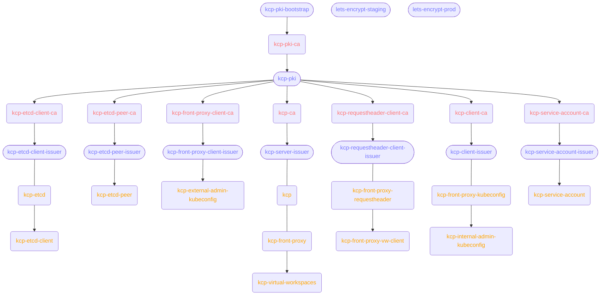

# kcp

This Helm chart deploys kcp, including the following components:

* kcp (server) Pod, including virtual workspace container
* etcd
* kcp-front-proxy

There is a [helper script](#install-to-kind-cluster-for-development) that you can use to setup a local development environment that runs kcp on a kind cluster.

## Requirements

* [cert-manager](https://cert-manager.io/docs/installation)
* Openshift route support (optional)
* Ingress Controller with TLS passthrough support (optional)
* Prometheus Operator (optional, see [Monitoring](#monitoring))

## Usage

[Helm](https://helm.sh) must be installed to use the charts. Please refer to Helm's
[documentation](https://helm.sh/docs) to get started.

Once Helm has been set up correctly, add the repo as follows:

    helm repo add kcp https://kcp-dev.github.io/helm-charts

If you had already added this repo earlier, run `helm repo update` to retrieve the latest versions
of the packages. You can then run `helm search repo kcp` to see the charts.

To install the kcp chart:

    helm upgrade --install my-kcp kcp/kcp --values ./myvalues.yaml

To uninstall the chart:

    helm delete my-kcp

## Configuration

For configuration options for this Helm chart, please see [values.yaml](./values.yaml).

### External Hostname

`externalHostname` is a required value in your `values.yaml`. It is a FQDN pointing to a DNS record that resolves both from external systems and from within the cluster to the kcp-front-proxy. The kcp-front-proxy endpoint needs to be accessible. See [Traffic Ingress](#traffic-ingress) for differences between methods of exposing kcp-front-proxy to the outside world.

Your `values.yaml` should therefore contain the following:

```yaml
externalHostname: my-kcp-instance.example.com
```

Some steps below require this external hostname, so consider exporting it on your shell:

```sh
export KCP_EXTERNAL_HOSTNAME=my-kcp-instance.example.com
```

### Ingress Method

To allow access to kcp from outside the cluster it is running in (which you usally want to set up), you will need to choose from the options below.

#### 1. LoadBalancer Service (recommended)

> [!NOTE]
> This method requires your Kubernetes cluster to support `LoadBalancer` services.

The easiest way to expose kcp is by making the kcp-front-proxy component available via a `Service` of type `LoadBalancer`.

To do so, use the following snippet in your `values.yaml`:

```yaml
kcpFrontProxy:
  service:
    type: LoadBalancer
``` 

This will create a `Service` called `kcp-front-proxy` with an external IP (or hostname).

After installing the chart with this option, make sure to create a DNS record for your external hostname that points to the external IP or hostname assigned to the `kcp-front-proxy` `Service`.

#### 2. Ingress

> [!NOTE]
> This method requires your Kubernetes cluster to have an ingress controller installed that has **TLS passthrough** support enabled.

It is also possible to expose kcp via an `Ingress` resource. However, only TLS passthrough is currently supported due to the way client certificates are handled. Make sure that your ingress controller supports TLS passthrough (e.g. [nginx-ingress-controller has it disabled by default](https://kubernetes.github.io/ingress-nginx/user-guide/tls/#ssl-passthrough)).

```yaml
kcpFrontProxy:
  ingress:
    enabled: true
    ingressClassName: "nginx" # use the ingress class of your ingress controller
```

To facilitate TLS passthrough, the default `values.yaml` includes suitable annotations on the `Ingress` object for nginx-ingress-controller. If you are using another ingress controller, you might have to add additional annotations to enable TLS passthrough.

#### 3. OpenShift Route

> [!CAUTION]
> This options is in the Helm chart for historical reasons, but it is not actively maintained and might be broken. Use at your own risk and consider using one of the alternatives above.


### Monitoring

Each component (etcd, kcp-front-proxy and kcp-server) has a `.monitoring` key that allows configuring monitoring for those components. At the moment, only Prometheus Operator is supported and is required as a pre-requisite on the cluster.

For all three, a `ServiceMonitor` resource can be created by setting `.[component].monitoring.serviceMonitor.enabled` to true. Monitoring for all components would therefore look like this:

```yaml
# enable ServiceMonitor for kcp-server.
kcp:
  monitoring:
    serviceMonitor:
      enabled: true

# enable ServiceMonitor for kcp-front-proxy.
kcpFrontProxy:
  monitoring:
    serviceMonitor:
      enabled: true

# enable ServiceMonitor for etcd.
etcd:
  monitoring:
    serviceMonitor:
      enabled: true
```

To collect metrics from these targets, a `Prometheus` instance targetting those `ServiceMonitors` is needed. A possible selector in the `Prometheus` spec is:

```yaml
serviceMonitorSelector:
  matchLabels:
    app.kubernetes.io/name: kcp
```

## PKI

The chart will create a full PKI system, with root CA, intermediate CAs and more. The diagram below
shows the default configuration, however the issuer for the `kcp-front-proxy` certificate can be
configured and used, for example, Let's Encrypt.



### Public TLS Certificate

Note that by default all certificates are signed by the Helm chart's own PKI and therefore will not be trusted by browsers. This is typical for Kubernetes(-like) APIs.

You can however change the `kcp-front-proxy`'s serving certificate to be issued by, for example, Let's Encrypt (LE).

A big caveat to changing the front-proxy's serving certificate to a third-party issuer (like Let's Encrypt) is that you will have to pass the Certificate Authority (CA) for the resulting serving certificate manually. To do so, create a `Secret` that contains a `ca.crt` (or similarly named) which can then be referenced in `kcpFrontProxy.certificateIssuer.secret`.

For Let's Encrypt, such a `Secret` can be created by downloading [isrgrootx1.pem](https://letsencrypt.org/certs/isrgrootx1.pem) from the Let's Encrypt website and passing it to `kubectl`:

```sh
kubectl create secret generic letsencrypt-prod-ca --from-file=ca.crt=./isrgrootx1.pem
```

Below is a more or less complete `values.yaml` for exposing kcp-front-proxy via Ingress and using LE certificates:

```yaml
externalHostname: "<external hostname as exposed by ingress method above>"

kcpFrontProxy:
  ingress:
    enabled: true
    ingressClassName: "nginx"

  certificateIssuer:
    name: kcp-letsencrypt-prod
    kind: ClusterIssuer
    # this references a secret containing the CA for the issuer above.
    # it has to be created manually and is not part of this chart.
    secret:
        name: "letsencrypt-prod-ca"
        key: "ca.crt"

letsEncrypt:
  enabled: true
  production:
    enabled: true
    email: lets-encrypt-notifications@example.com
```

## Initial Access

To access the deployed kcp, it will be necessary to create a kubeconfig which connects via the
front-proxy external endpoint (specified via `externalHostname` above).

The content of the kubeconfig will depend on the kcp authentication configuration, below we describe
one option which uses client-cert auth to enable a kcp-admin user.

> [!WARNING]
> This example allows global admin permissions across all workspaces, you may also want to
> consider using more restricted groups, for example `system:kcp:workspace:access`, to provide a
> user `system:authenticated` access to a workspace.

### Create kubeconfig and add CA cert

First we get the CA cert for the front-proxy, saving it to a file `ca.crt`

    kubectl get secret kcp-front-proxy-cert -o=jsonpath='{.data.tls\.crt}' | base64 -d > ca.crt

> [!IMPORTANT]
> If you are using a third-party certificate issuer (see [Public TLS Certificate](#public-tls-certificate)), your `ca.crt` has to be the issuer CA instead.

Now we create a new kubeconfig which references the `ca.crt`

    kubectl --kubeconfig=admin.kubeconfig config set-cluster base --server https://$KCP_EXTERNAL_HOSTNAME:443 --certificate-authority=ca.crt
    kubectl --kubeconfig=admin.kubeconfig config set-cluster root --server https://$KCP_EXTERNAL_HOSTNAME:443/clusters/root --certificate-authority=ca.crt

### Create client-cert credentials

Now we must add credentials to the kubeconfig, so requests to the front-proxy may be authenticated.

One way to do this is to create a client certificate with a cert-manager `Certificate`

    cat <<EOF | kubectl apply -f -
    apiVersion: cert-manager.io/v1
    kind: Certificate
    metadata:
      name: cluster-admin-client-cert
    spec:
      commonName: cluster-admin
      issuerRef:
        name: kcp-front-proxy-client-issuer
      privateKey:
        algorithm: RSA
        size: 2048
      secretName: cluster-admin-client-cert
      subject:
        organizations:
        - system:kcp:admin
      usages:
      - client auth
    EOF

This will result in a `cluster-admin-client-cert` secret which we can again save to local files:

    kubectl get secret cluster-admin-client-cert -o=jsonpath='{.data.tls\.crt}' | base64 -d > client.crt
    kubectl get secret cluster-admin-client-cert -o=jsonpath='{.data.tls\.key}' | base64 -d > client.key
    chmod 600 client.crt client.key

We can now add these credentials to the `admin.kubeconfig` and access kcp:

    kubectl --kubeconfig=admin.kubeconfig config set-credentials kcp-admin --client-certificate=client.crt --client-key=client.key
    kubectl --kubeconfig=admin.kubeconfig config set-context base --cluster=base --user=kcp-admin
    kubectl --kubeconfig=admin.kubeconfig config set-context root --cluster=root --user=kcp-admin
    kubectl --kubeconfig=admin.kubeconfig config use-context root
    export KUBECONFIG=$PWD/admin.kubeconfig
    kubectl ws .
    Current workspace is 'root'.

## Install to kind cluster (for development)

There is a helper script to install kcp to a [kind](https://github.com/kubernetes-sigs/kind) cluster.
It will install cert-manager and kcp. The `kind` cluster binds to host port 8443 for exposing kcp.
This particular configuration is useful for development and testing, but will not work with Let's Encrypt. You will need to have `yq` installed to run this script.

From the root directory of this repository, run:

    ./hack/kind-setup.sh

Pre-requisites established by that script:

* `kind` executable installed at `/usr/local/bin/kind`
* kind cluster named `kcp`
* [cert-manager](https://cert-manager.io/) installed on the cluster
* `/etc/hosts` entry for `kcp.dev.local` pointing to `127.0.0.1`

The script will then install kcp the following way:

    helm upgrade --install my-kcp ./charts/kcp/ \
      --values ./hack/kind-values.yaml \
      --namespace kcp \
      --create-namespace

See [hack/kind-values.yaml](./hack/kind-values.yaml) for the values passed to the Helm chart.
